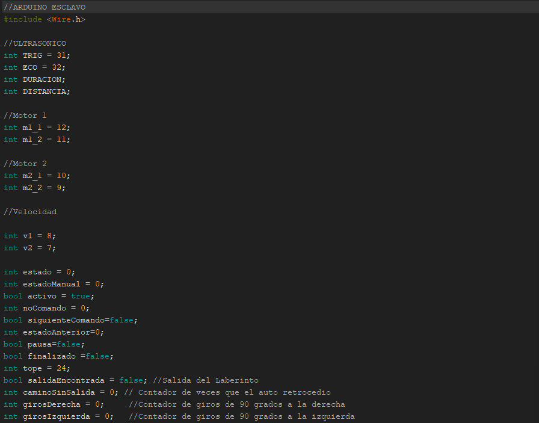

# Práctica 2 - Manual Técnico

## INTEGRANTES
| Nombre                           | Carné                                      |
|:--------------------------------:|:------------------------------------------:|
| Daniel Reginaldo Dubón Rodríguez | 201901772                                  |
| Erick Ivan Mayorga Rodríguez     | 201901758                                 	|
| Edmy Marleny Mendoza Pol         | 201901212                                	|
| Kevin Steve Martínez Lemus       | 202004816                  				|

## INTRODUCCIÓN

Se realizó un dispositivo tipo automóvil capaz de encontrar una ruta para resolver un laberinto, detectando obstáculos, obteniendo estadísticas de los movimientos y presentando diversos estados como mensajes en una pantalla LCD, este cuenta con un centro de control conformado por 4 botones, y se utilizó una red de Arduinos usando I2C uno siendo maestro y otro esclavo.

## COMPONENTES UTILIZADOS
- 2 Arduinos Mega  
  
- 1 Sensor Ultrasónico  
  
- 1 Sensor De Color  
  
- 4 Botones  
  
- 1 Pantalla LCD  
  
- 2 Motores  
  
- Puente H  
  
- PowerBank  
  

## RED DE ARDUINOS
Para la desarrollar la red de arduinos se utilizo el protocolo I2C.

Se utilizaron los arduinos de la siguiente manera:

- **Maestro :** El dispositivo maestro se encarga de:
    - Controlar la pantalla LCD.
	- Recabar la información recibida.
	- Manejar la lista de moviemientos del modo manual
	- Calcular estadísticas
	- Control de botones
	- Contadores

- **Esclavo :** El dispositivo esclavo manejará:
	- Los movimientos del automóvil.
	- La detección de obstáculos
	- La detección de colores
	
## CODIGO UTILIZADO
### Maestro
Las variables globales nos permitirán definir las entradas, la salidas y manejar los datos correspondientes a los estados del mismo.  

Se definieron los caracteres especiales que se mostrarán en la pantalla LCD.  

En la sección de declaración de pines se inicia la comunicación entre los dos arduinos con el comando `Wire.begin();`

Con el método `mensajeInicial` se muestra el mensaje de inicio con un desplazamiento en la
línea superior de izquierda a derecha de la pantalla LCD.

Se utilizó la variable `estado` para saber que debe de ejecutar el arduino maestro, ya sea mostrar los diferentes mensajes en la pantalla o entrar a los diferentes modos de Laberinto.

Para la recolección de intrucciones dentro del modo manual se utilizo el siguiente código.

### Esclavo
Las variables globales nos permitirán definir las entradas, la salidas y manejar los datos correspondientes a los estados del mismo.

En la sección de declaración de pines se inicia la comunicación entre los dos arduinos con el comando `Wire.begin();` estableciendo como canal 0x01

Se utilizó la función `ComandoDeEntrada` para recibir el comando del arduino maestro y la función `peticion` para realizar una solicitud al arduino maestro.

Para la parte de movimiento del automóvil se utilizo las funciones `goLeft` y `goRight` para realizar los giros y las funciones `goForward` y `goBackward` para avanzar y retroceder respectivamente.

El manejo del sensor ultrasonico esta estipulado en la funcion `getDistancia` que permite generar y recibir pulsos del mismo, para poder asi medir la distancia entre el automóvil y el obstacúlo.

Para controlar el sensor de color se utilizo el siguiente codigo, el cual permite establecer fotodiodos con su respectivo filtro y leer el color mediante `pulseIn()`.

De la misma manera que el arduino maestro, se utiliza una variable `estado`, que nos permite saber que se debe de ejecutar.

La función `modoMecanico()` ejecuta el modo automático de resolución del Laberinto, teniendo el siguiente codigo.

